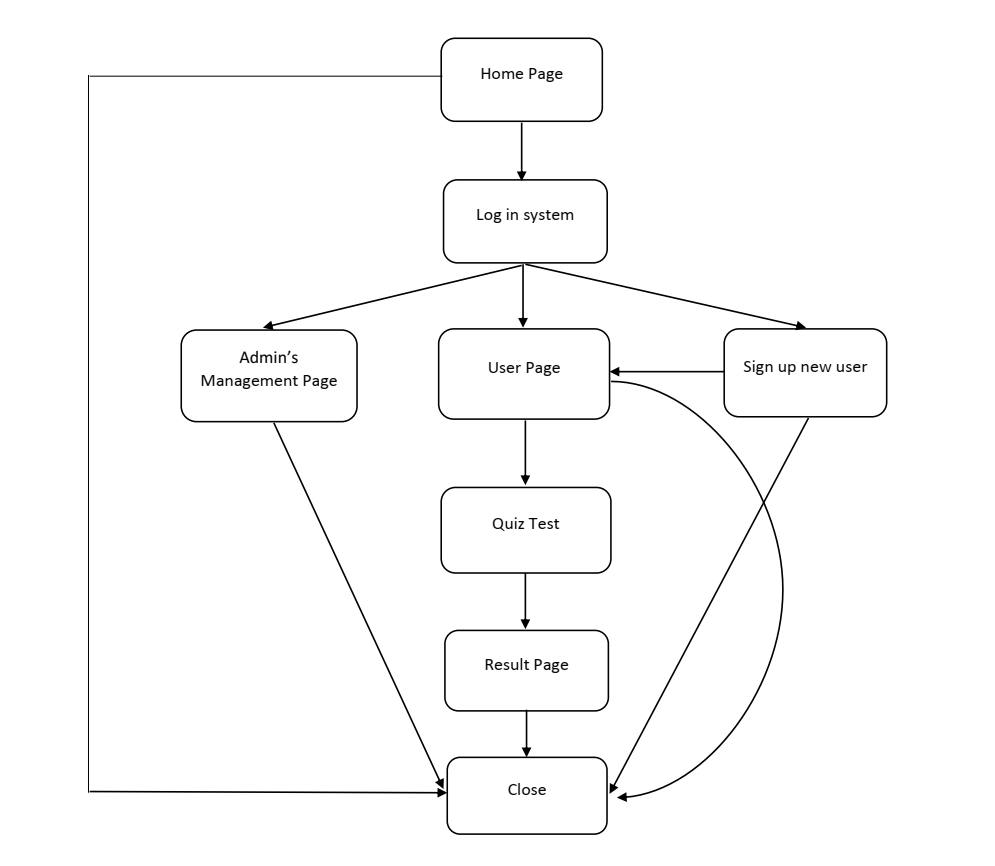
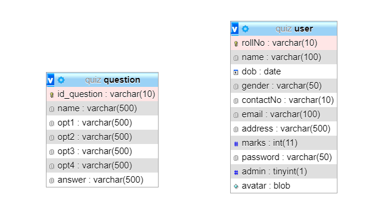
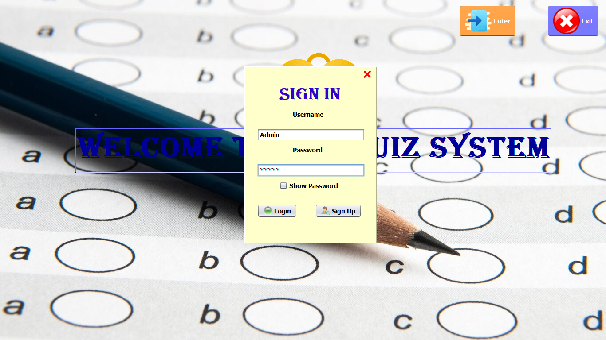
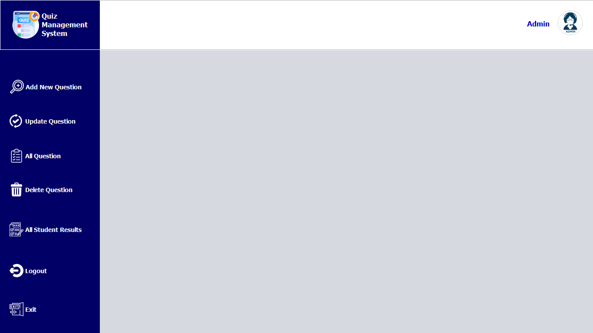
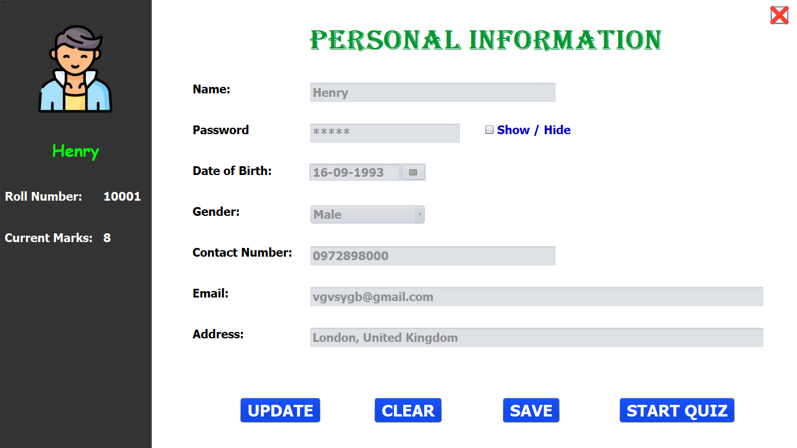
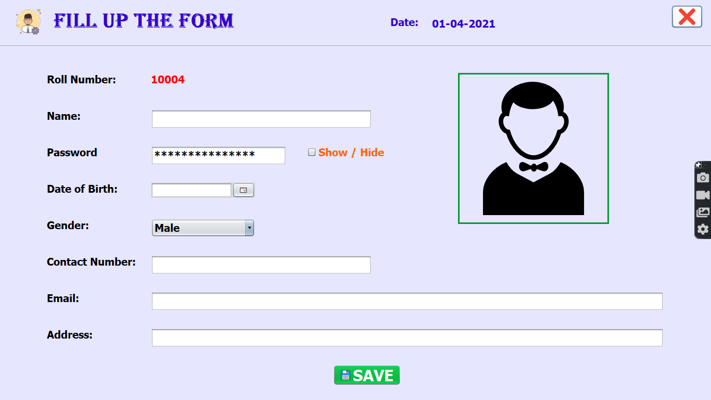

# QuizOrExamManagementSystem
Multiple choice question management system is built by Java Swing &amp; JDBC API (MySQL)  
🔶**Quiz data flowchart**   

  
🔴***Home Page:*** chooses to enter or quiz program.
🔴***Log in system:*** can choose to go to Admin Page or User Page or Sign-Up New User.
🔴***Admin Page:*** manage Users and Questions.
🔴***User Page:*** member can modify own personal infomation or participant in Test.
🔴***Sign-Up New User Page:*** guests need to fill in all of cells, select your avatar from PC and then go to User Page.
🔴***Quiz Test:*** members will complete a Test during 10 minutes with 10 questions, each question includes 4 options.
🔴***Result Page:*** displays user's score, then member can take the test again or close program.
# 🔷Database
Creating Quiz Database with 2 table: User & Question

# 🔷Screen Shots
**Main Interface**
  

   
**Sign-in Page**
  

   
**Admin Page**
  

   
**User's Detailed Info Page**
  

   
**Multiple Choice Test**
  

   
**Result Test Page**
  

   
**Register Member Page**
  

   
# 🔷Demo
**Register New User**
  

   
**Joining Test**
  

   
**Admin's Mamagemnet Page & "Add" Question Task**
  

   
**"Edit & Delete" Question Task**
  

   
**User Administration**
  

